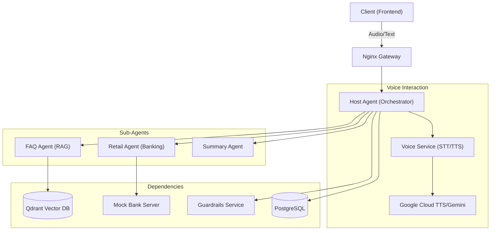
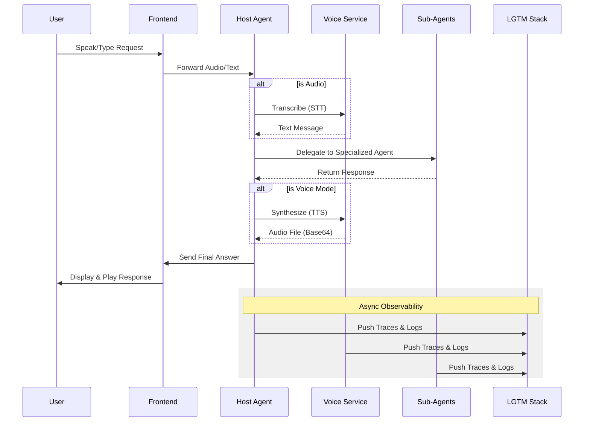

# FinAI: Multi-Agent AI Banking platform

FinAI is a state-of-the-art, multi-agent AI banking platform designed to provide a seamless, secure, and intelligent customer support experience. Built with a modular microservices architecture, it leverages specialized AI agents to handle diverse banking tasks—from general inquiries to complex retail banking transactions.

---

## Key Features

*   **Premium Voice Interaction**: 
    *   **Speech-to-Text (STT)**: Real-time transcription using Gemini-powered audio processing.
    *   **Ultra-High-Fidelity TTS**: Leverages Google's latest generative **Journey** (English) and **Chirp3-HD** (Arabic) models for near-human quality.
    *   **Egyptian Dialect Support**: Features full dialect mirroring and localized vocal synthesis for an authentic user experience.
*   **Intelligent Banking Support**:
    *   **FAQ Agent**: Uses RAG (Retrieval-Augmented Generation) with a vector database to provide instant, accurate answers to general banking questions.
    *   **Retail Agent**: Integrates with banking APIs to facilitate account management and transactions (simulated via Mock Bank Server).
    *   **Summary Agent**: Provides concise conversation summaries for improved handover and record-keeping.
*   **Enterprise-Grade Guardrails**: Real-time safety and compliance checks on all AI interactions.
*   **Full Observability**: Integrated LGTM stack (Loki, Grafana, Tempo, Mimir/Prometheus) for deep-dive tracing, logging, and performance monitoring.
*   **Production Ready**: Automated deployment to Google Kubernetes Engine (GKE) Autopilot with automated TLS via Let's Encrypt.

---

## System Architecture

### High-Level Request Flow



### Detailed Component Interaction

FinAI follows a decoupled microservices pattern where each agent is an independent service:



---

## Tech Stack

*   **Frontend**: React, Vite, TypeScript, TailwindCSS.
*   **Backend**: Python, FastAPI, LangChain, Pydantic.
*   **Voice**: Google Cloud Text-to-Speech (Chirp3-HD, Journey, Neural2), Gemini Audio (STT), SSML Rhythm Tuning.
*   **AI/LLM**: Google Gemini, OpenAI (configurable).
*   **Databases**: Qdrant (Vector), PostgreSQL (Relational).
*   **Observability**: Grafana, Loki, Tempo (OpenTelemetry).
*   **Infrastructure**: Docker, Kubernetes (GKE), Nginx, cert-manager.

---

## Getting Started (Local Development)

### Prerequisites
- Docker & Docker Compose
- Python 3.10+ (for local scripts)
- Make (optional, but recommended)

### Setup
1.  **Clone the repository**:
    ```bash
    git clone https://github.com/Hany-Erfan/FinAI.git
    cd FinAI
    ```

2.  **Environment Variables**:
    Copy the example env files and fill in your API keys.
    ```bash
    cp .env.example .env
    ```
    Ensure the following voice configs are set for the best experience:
    ```env
    GOOGLE_API_KEY=your_key
    VOICE_TTS_EN_VOICE=en-US-Journey-F
    VOICE_TTS_AR_VOICE=ar-XA-Chirp3-HD-Kore
    GUARDRAILS_LLM_MODEL=gemini-1.5-flash
    ```

3.  **Spin up the stack**:
    ```bash
    make up
    # Or: docker-compose up -d
    ```

4.  **Access the Application**:
    - **Frontend**: `http://localhost:5173`
    - **Host Agent API**: `http://localhost:8000`
    - **Grafana**: `http://localhost:3000`

### Development Productivity
The backend services (Host Agent, FAQ Agent, Guardrails Service) are configured with **Hot Reload** enabled in Docker. Any changes made to the Python code in the `backend/` directory will be reflected immediately without needing to restart the containers.

### Advanced Performance Monitoring
The Host Agent now provides a detailed **REQUEST PERFORMANCE SUMMARY** in the logs for every interaction. This includes:
- **PII Masking & Guardrails**: Time spent on pre-processing and safety checks.
- **Host Agent Retries**: History of retries for the main routing logic (max 20 attempts).
- **Sub-Agent Breakdown**: Precise timing for each specialized agent (Retail, FAQ, etc.).
- **Internal Sub-Agent Retries**: Nested retry history inside sub-agents (e.g., if retrieval fails, you see exactly how many times the sub-agent retried internally).
- **Fallback Logic**: If the LLM returns empty text, the system automatically falls back to the raw sub-agent response to ensure the user always receives an answer.

---

## Testing

Integration, auth, and UI tests live in `tests/` and run against the local stack:

```bash
make up                               # start all services
pip install -r tests/requirements.txt
pytest tests/ -v                      # full suite, or target a file, e.g. tests/test_integration.py
```

The same suite runs in CI (GitHub Actions) on every push and pull request to `main`.

---

## Deployment (Production)

The platform is optimized for **GKE Autopilot**.

1.  **Deployment Script**:
    Run the automated deployment script which handles cluster provisioning, IP reservation, and service deployment:
    ```bash
    make deploy-cluster
    ```

2.  **Detailed Guide**:
    For comprehensive deployment instructions, infrastructure details, and troubleshooting, please refer to the:
     **[DEPLOYMENT.README.md](./DEPLOYMENT.README.md)**

---

## Observability & Metrics

FinAI uses **OpenTelemetry** for full-stack visibility.
- **Traces**: View the exact path of a message across all sub-agents in Grafana Tempo.
- **Logs**: Centralized logging via Loki.
- **Metrics**: Real-time performance dashboards in Grafana.

To upload the standard POC dashboard to your environment:
```bash
make upload-dashboard
```

---

## License & Security

This project is licensed under the MIT License. For security disclosures or issues, please contact the security team.


## Credits

Project lead, architecture, and agent orchestration: Hany Erfan.

Built with contributions from Samuel Youssif, Nadine Tarek, Lamees Mohee, Samer Abaza, Ahmed Hammad, and Kareem Hashem, under his direction.
