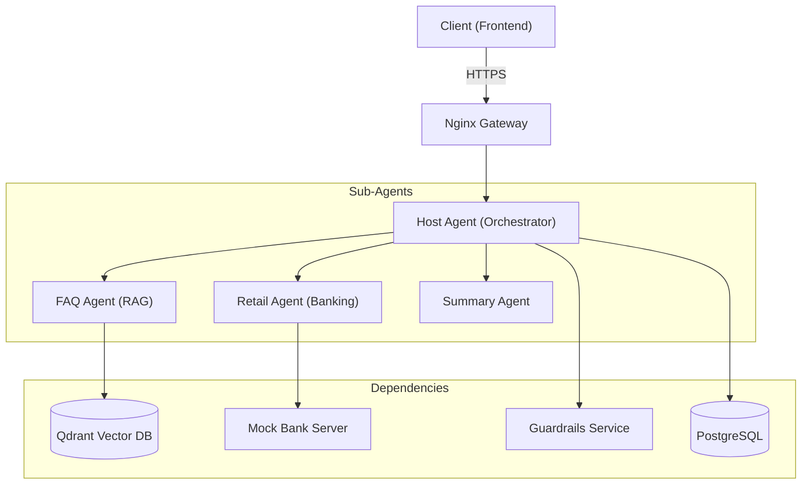
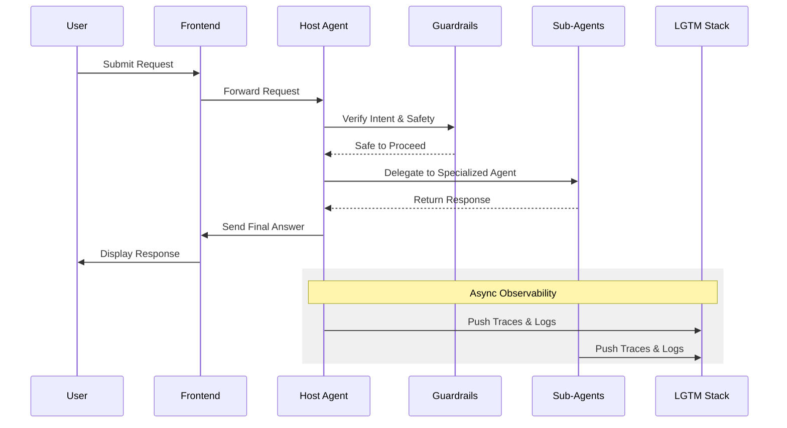

# FinAI: Multi-Agent AI Banking platform

FinAI is a state-of-the-art, multi-agent AI banking platform designed to provide a seamless, secure, and intelligent customer support experience. Built with a modular microservices architecture, it leverages specialized AI agents to handle diverse banking tasks—from general inquiries to complex retail banking transactions.

---

## 🚀 Key Features

*   **Orchestrated Multi-Agent System**: A central "Host Agent" intelligently routes requests to specialized sub-agents based on user intent.
*   **Intelligent Banking Support**:
    *   **FAQ Agent**: Uses RAG (Retrieval-Augmented Generation) with a vector database to provide instant, accurate answers to general banking questions.
    *   **Retail Agent**: Integrates with banking APIs to facilitate account management and transactions (simulated via Mock Bank Server).
    *   **Summary Agent**: Provides concise conversation summaries for improved handover and record-keeping.
*   **Enterprise-Grade Guardrails**: Real-time safety and compliance checks on all AI interactions.
*   **Full Observability**: Integrated LGTM stack (Loki, Grafana, Tempo, Mimir/Prometheus) for deep-dive tracing, logging, and performance monitoring.
*   **Production Ready**: Automated deployment to Google Kubernetes Engine (GKE) Autopilot with automated TLS via Let's Encrypt.

---

## 🏗️ System Architecture

### High-Level Request Flow



### Detailed Component Interaction

FinAI follows a decoupled microservices pattern where each agent is an independent service:



---

## 🛠️ Tech Stack

*   **Frontend**: React, Vite, TypeScript, TailwindCSS.
*   **Backend**: Python, FastAPI, LangChain, Pydantic.
*   **AI/LLM**: Google Gemini, OpenAI (configurable).
*   **Databases**: Qdrant (Vector), PostgreSQL (Relational).
*   **Observability**: Grafana, Loki, Tempo (OpenTelemetry).
*   **Infrastructure**: Docker, Kubernetes (GKE), Nginx, cert-manager.

---

## 💻 Getting Started (Local Development)

### Prerequisites
- Docker & Docker Compose
- Python 3.10+ (for local scripts)
- Make (optional, but recommended)

### Setup
1.  **Clone the repository**:
    ```bash
    git clone https://github.com/intellagentix/customerbuddy.git
    cd customerbuddy
    ```

2.  **Environment Variables**:
    Copy the example env files and fill in your API keys (e.g., `GOOGLE_API_KEY`).
    ```bash
    cp .env.example .env
    cp .env.secrets.example .env.secrets
    ```

3.  **Spin up the stack**:
    ```bash
    make up
    # Or: docker-compose up -d
    ```

4.  **Access the Application**:
    - **Frontend**: `http://localhost:5173`
    - **Host Agent API**: `http://localhost:8000`
    - **Grafana**: `http://localhost:3000` (optional profile: `make up monitor`)

---

## 🚢 Deployment (Production)

The platform is optimized for **GKE Autopilot**.

1.  **Deployment Script**:
    Run the automated deployment script which handles cluster provisioning, IP reservation, and service deployment:
    ```bash
    make deploy-cluster
    ```

2.  **Detailed Guide**:
    For comprehensive deployment instructions, infrastructure details, and troubleshooting, please refer to the:
    👉 **[DEPLOYMENT.README.md](./DEPLOYMENT.README.md)**

---

## 📊 Observability & Metrics

FinAI uses **OpenTelemetry** for full-stack visibility.
- **Traces**: View the exact path of a message across all sub-agents in Grafana Tempo.
- **Logs**: Centralized logging via Loki.
- **Metrics**: Real-time performance dashboards in Grafana.

To upload the standard POC dashboard to your environment:
```bash
make upload-dashboard
```

---

## 🛡️ License & Security

This project is licensed under the MIT License. For security disclosures or issues, please contact the security team.

